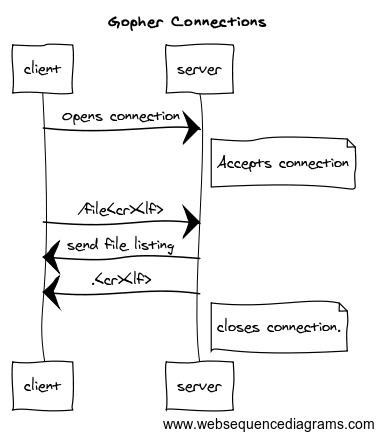

# Gopher Go Challange

## Gophers getting the Gopher Protocol.

For this challenge we are going to build a simple gopher server. Gopher was an 
internet protocol that predate HTTP. It's a simple [protocol](http://www.ietf.org/rfc/rfc1436.txt), but we are going to 
build a simpler version of it. 

Though the default port for gopher is 70, we will be using port 1337.

There are three things your server is expected to handle.

##Initial connection as diagramed:


##Directory Listing


##Text files


##Binary Files


I would recommend you implement things in the order listed.

## Some Hints and Examples:

Here is some code for listening for a connection.

```go
go func() {
	var err error
	if r.listener, err = net.Listen("tcp", ":1337"); err != nil {
		log.Fatalln(err)
	}

	log.Println("Chat room started: 6000")

	for {
		conn, err := r.listener.Accept()
		if err != nil {
			// Check if the error is temporary or not.
			if e, ok := err.(temporary); ok {
				if !e.Temporary() {
					log.Println("Temporary: Chat room shutting down")
					r.wg.Done()
					return
				}
			}

			log.Println("accept-routine", err)
			continue
		}

		// Add this new connection to the room.
		// Do the work with the connection.
	}
}()

```
This code was lifited from [here](https://github.com/ardanlabs/gotraining/blob/master/09-concurrency_patterns/chat/chat.go).

Please, consult it for more information.

If there is any confusion please ask; and I will try and clarify.
